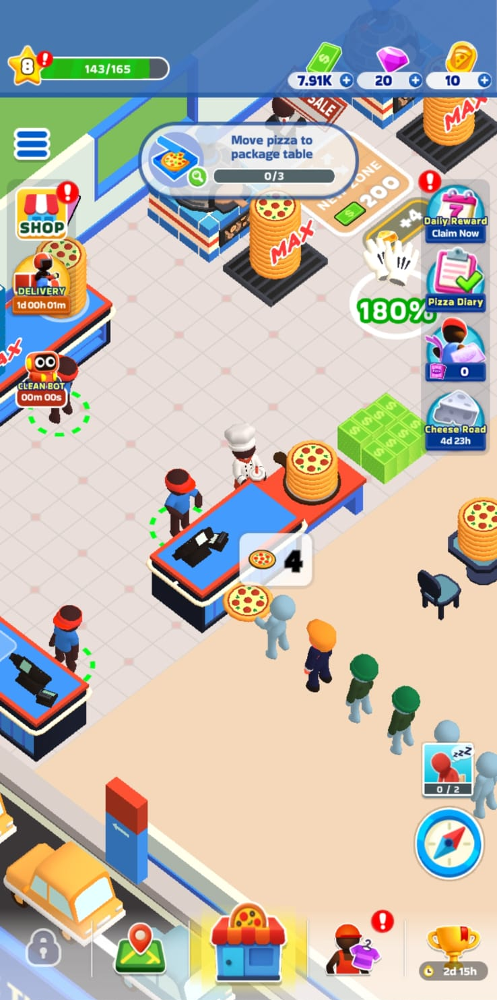
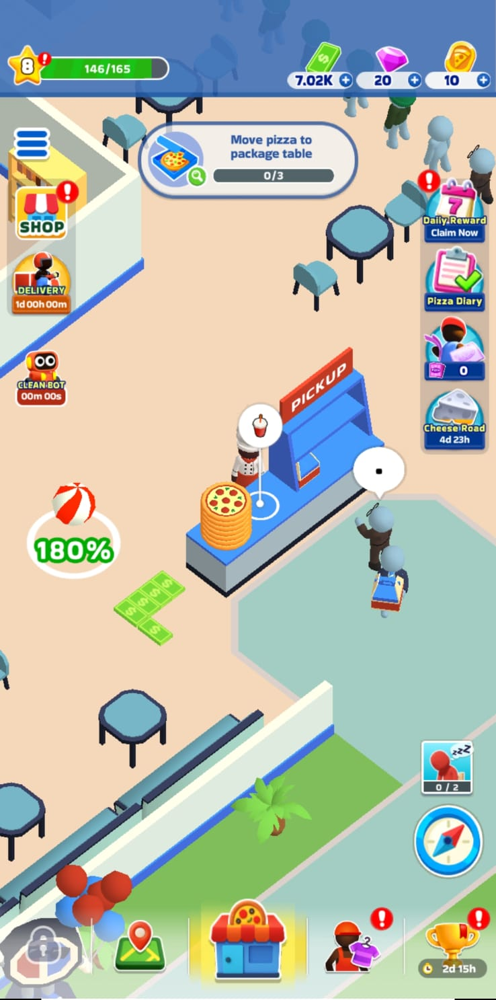
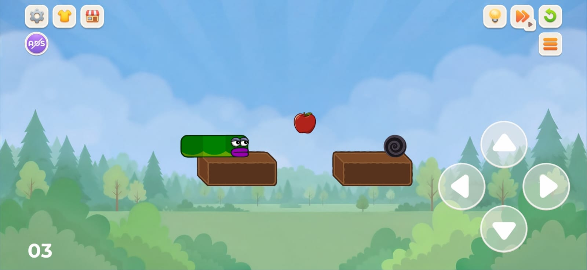
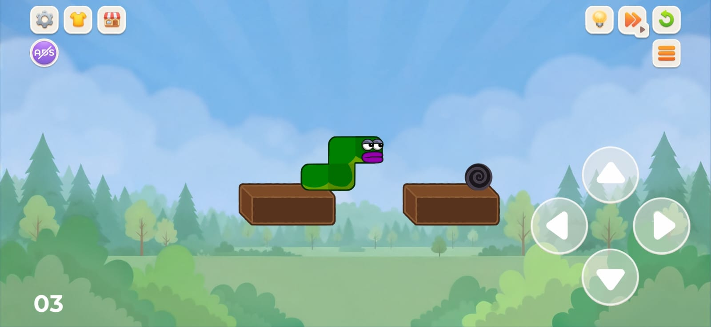
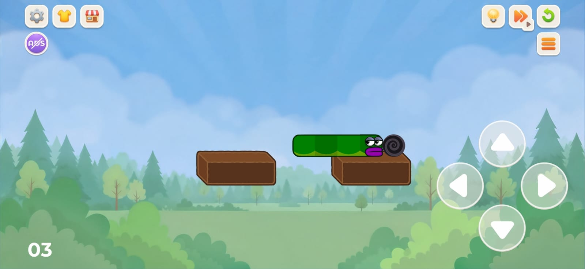
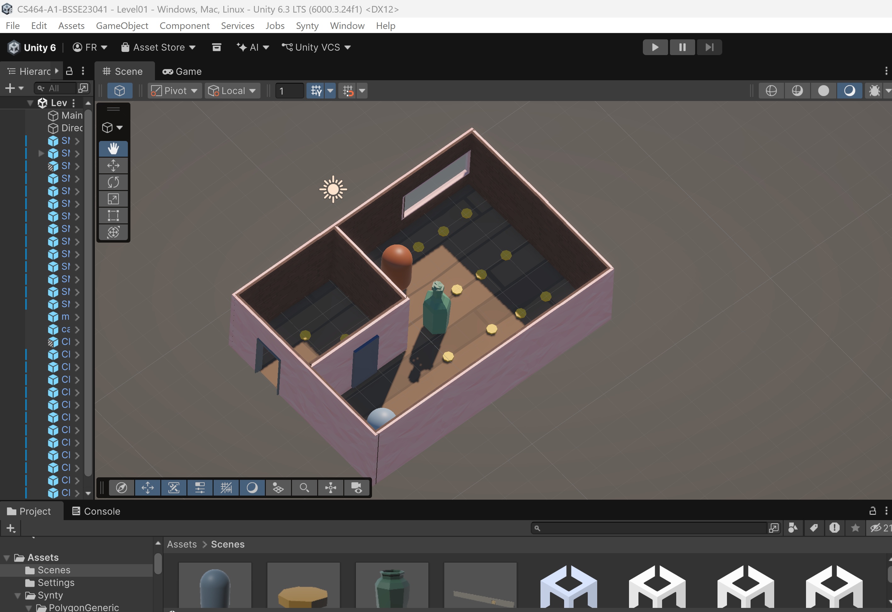
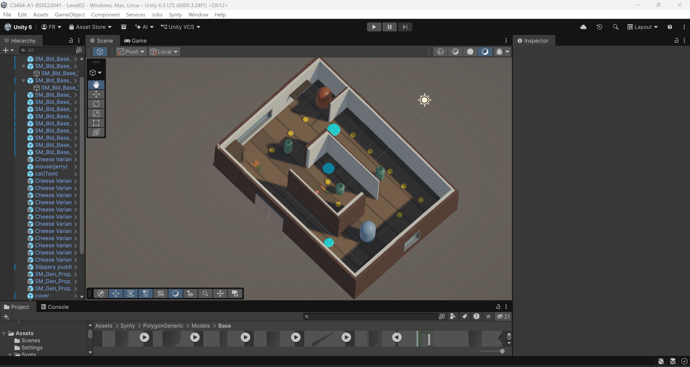
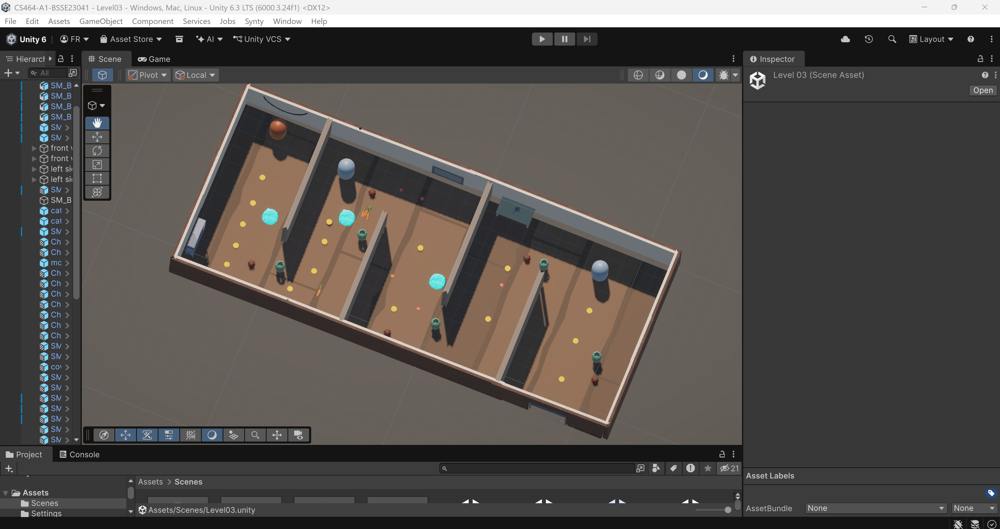
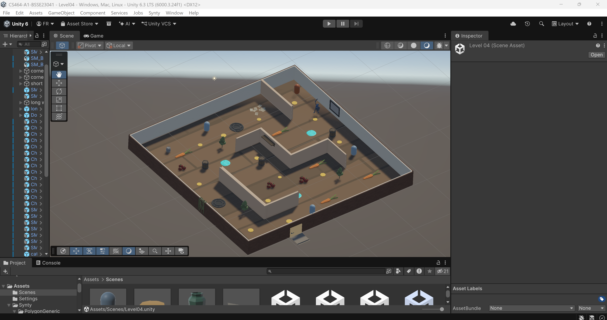
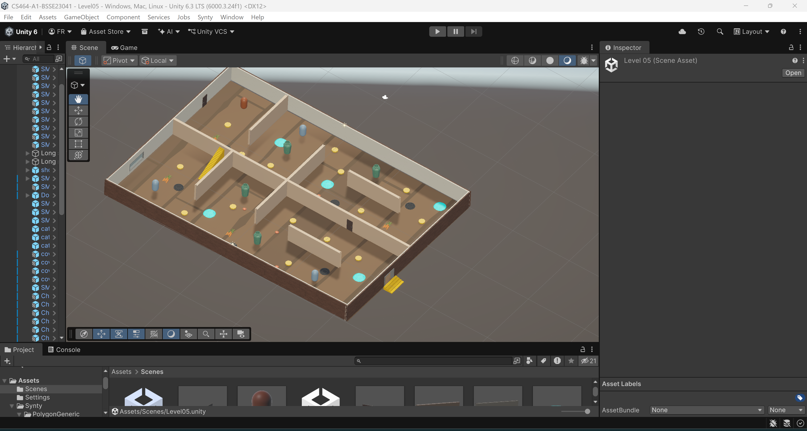

# CS464 Assignment 01 · Fasiha Rohail · BSSE23041

## Game 1 · Pizza Ready
- **Store link:** https://play.google.com/store/apps/details?id=io.supercent.pizzaidle
- **Genre:** Idle / Tycoon Restaurant Simulator
- **I played:** 40 minutes, unlocked Counter, Drive-Thru, and hired 3 staff members
- **Video:** https://youtu.be/GZ8ec8a2fOg

1. [M1, M2, M3, M5] · Player standing at the main counter serving a customer queue with a MAX capacity pizza stack and a $200 expansion tile nearby.
2. [M6] · Player interacting with the Table Upgrade station showing speed and sale price stat multipliers.
3. [M4, M7] · Automated worker NPC serving the pickup station alongside on-ground cash drops ready for collection.

| # | Mechanic | Dynamic | Aesthetic | Bartle type |
|---|---|---|---|---|
| M1 | Virtual joystick movement with auto-interaction on station overlap | Players route optimized loops around the store floor between ovens, counters, and trash stations | Challenge: test of efficient pathfinding and spatial planning under rush conditions | Achiever: optimizes movement routes to increase pizzas served per minute |
| M2 | Hard carry capacity limit ($N$ items max, upgraded via cash) | Players stack pizzas to capacity, deciding when to deliver or drop extra items to clear capacity | Submission: creates a calm, repetitive rhythm of filling and emptying inventory | Achiever: increasing a numerical stat threshold to maximize throughput |
| M3 | Dual-window customer spawning queue (Counter & Drive-thru) | Players monitor both queues and switch between windows whenever customer lines back up | Challenge: prioritizing tasks dynamically under rising time pressure | Achiever: clearing customer queues to maintain high store rating |
| M4 | On-ground cash drop and proximity pickup | Players sweep up money piles in continuous floor passes to fund next store upgrades | Sensation: immediate visual and audio feedback of floating cash numbers | Achiever: instant, tangible score increase directly impacting store balance |
| M5 | Pay-to-unlock expansion zones with cash threshold counters | Players save cash reserves and stand on marked floor tiles to trigger room expansions | Discovery: reveals new store areas, equipment, and customer types | Explorer: curiosity about what new content unlocks next in the shop layout |
| M6 | Exponential cost scaling per upgrade level ($Cost = Base \times Scale^{level}$) | Players evaluate trade-offs between upgrading speed, capacity, or pizza price | Challenge: resource allocation and mathematical optimization of income growth | Achiever: min-maxing upgrade investments for maximum return on investment |
| M7 | Automated worker NPCs with upgradable speed and capacity parameters | Players shift from manual labor to supervisory management as automated workers take over tasks | Fantasy: roleplay of managing and expanding a thriving business empire | Explorer: observing how automated systems interact to keep the store running |

**Aesthetic profile:** Submission (repetitive, low-stress carrying and cash sweeping loops), Fantasy (building a business empire from scratch), and Challenge (optimizing routes and upgrade efficiency).

**Player types**
- **Primary: Achiever** (**Acting × World**), because 5 out of 7 mechanics (M1, M2, M3, M4, M6) center on acting directly on the game world to grow numeric values, clear queues, and maximize income throughput.
- **Secondary: Explorer** (**Interacting × World**), because M5 and M7 reward interacting with the world to unlock new floor areas, discover new machinery, and test automated worker setups.

---

## Game 2 · Apple Worm
- **Store link:** https://play.google.com/store/apps/details?id=com.icestonesoft.pavellotohov.appleworm.partners
- **Genre:** Grid Based Physics Logic Puzzle
- **I played:** 35 minutes, completed 7 levels
- **Video:** https://youtu.be/liJmh0vq8_Q

1. [M1, M3] · Worm extending over a ledge with unsupported rear segments subject to gravity.
2. [M2, M4] · Worm eating an apple, growing +1 segment longer, and bridging across a gap.
3. [M6, M7] · Worm navigating past spike hazards toward the final exit portal.

| # | Mechanic | Dynamic | Aesthetic | Bartle type |
|---|---|---|---|---|
| M1 | Grid-based discrete step movement (1 cell per input key) | Players pause and plan sequences of moves ahead before committing to an input | Challenge: pure forward-thinking logic puzzle without real-time reflex pressure | Explorer: studying grid layouts to deduce how moves unfold |
| M2 | Snake body segment-follow algorithm (Segment $i$ moves to cell of Segment $i-1$) | Players fold and bend the body into spatial shapes to fit inside tight grid spaces | Discovery: figuring out how complex body shapes occupy spatial geometry | Explorer: experimenting with body folding patterns in confined spaces |
| M3 | Unsupported segment gravity check (Falls if zero underlying tile support) | Players shift weight centers across chasms, risking falls to hook onto far ledges | Discovery: learning physics edge-cases and gravity behavior on overhangs | Explorer: testing physics rules to see where the worm safely balances |
| M4 | Apple consumption growth trigger (+1 body segment upon entering apple cell) | Players plan the exact order of eating apples, as a longer body enables bridging but hinders maneuvering | Challenge: eating order forms the primary structural constraint of the puzzle | Achiever: completing optional apple collection objectives per level |
| M5 | Solid body collision and self-platforming (Segments act as physical barriers/bridges) | Players position their own tail over gaps to use as a rigid platform for reaching high ledges | Expression: finding creative alternative paths to reach the level target | Explorer: finding novel structural uses for the worm's extended body |
| M6 | Instant death on hazard collision (Spikes trigger immediate level reset) | Players attempt risky paths, fail fast without penalty, and adjust their strategy | Challenge: overcoming strict failure conditions through trial and error | Achiever: clearing hazard-dense levels without dying |
| M7 | Exit portal level-complete trigger | Players navigate the head segment into the portal to complete the level and unlock the next | Challenge: clear victory condition marking puzzle resolution | Achiever: completing levels sequentially to progress through the game |

**Aesthetic profile:** Challenge (solving spatial logic puzzles and navigating hazards), Discovery (uncovering how gravity, growth, and geometry rules interact), and Expression (devising unique body-bridging solutions).

**Player types**
- **Primary: Explorer** (**Interacting × World**), because M1, M2, M3, and M5 require interacting with the world to understand, test, and manipulate physical constraints, body geometry, and gravity mechanics.
- **Secondary: Achiever** (**Acting × World**), because M4, M6, and M7 provide structured goal completion (eating all apples, surviving hazards, and reaching the exit portal) to progress through the level ladder.

---

## Level blockouts

| Level | Screenshot | Its idea | Wayfinding tool |
|---|---|---|---|
| Level01 |  | Basic linear stealth teaching basic movement, cheese pickup, single Tom obstacle, and simple cover. | Straight cheese trail leading directly from spawn to the exit door. |
| Level02 |  | Loop layout requiring full traversal to collect all food, triggering noise carrots, and backtracking to start. | Water puddle placement and vase hideout points framing the returning pathway. |
| Level03 |  | Serpentine chamber layout with dual Tom hazards, speed-boost red peppers, and a guarded exit. | Red pepper power-ups placed at key choke points signaling corridor directions. |
| Level04 |  | 4-quadrant grid introducing triple cat hazards, fatal black hole pitfalls, and vertical stair hideouts. | Wall stair structures and central corridor partitions guiding quadrant navigation. |
| Level05 |  | Segregated 4-room structure connected via interconnecting doorways for tactical room transitions and hiding. | Doorway openings between interior dividing walls marking transition paths between sections. |